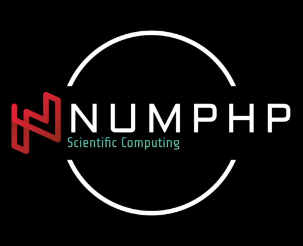

a lite &amp; memory efficient  php library for scientific computing

numphp is a library that provides objects for computing large sets of numbers in [PHP](https://php.net).

## Installation
Install Tensor into your project with [Composer](https://getcomposer.org/):
```sh
$ composer require ghostjat/numphp
```
##Sample Code
```php
require __DIR__ . '/../vendor/autoload.php';

use numphp\tensor;

tensor::time();
tensor::getMemory();
$ta = tensor::randn(1000, 1000);    
$tb = tensor::randn(1000, 1000); // to generate random 2d matrix
$ta->dotMatrix($tb);            // do a dot operation on given matrix
tensor::getMemory();           // get memory use
tensor::time();               // get time

/**
 * Memory-Consumed 15.3mb
 * Time-Consumed:- 0.26119709014893
 */
```
## Requirements
- [PHP](https://php.net) 7.4+ with ffi & blas

Make sure you have all the necessary tools installed such as libblas,ffi.

## Performance

## License
The code is licensed [MIT](LICENSE) and the documentation is licensed [CC BY-NC 4.0](https://creativecommons.org/licenses/by-nc/4.0/).

